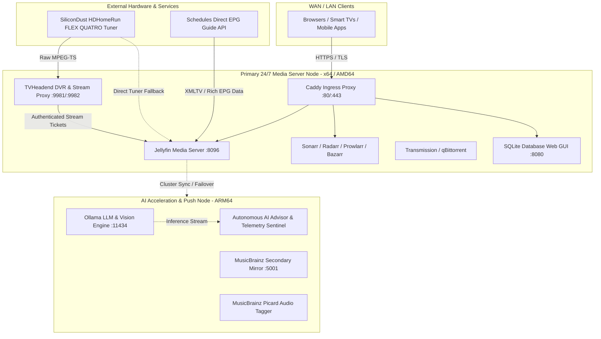

# MediaStack: Dual-Node Resilient Home Media & AI Cluster

[](https://docs.docker.com/compose/)
[](#system-architecture)
[](https://caddyserver.com)
[](https://jellyfin.org)
[](LICENSE)

**MediaStack** is a production-grade, highly automated, dual-node self-hosted media and AI acceleration cluster. Designed for continuous 24/7 uptime, hardware-accelerated transcoding, over-the-air (OTA) broadcast TV streaming and DVR, automated media acquisition, lossless metadata tagging, and local LLM/vision inference.

---

## Table of Contents

- [System Architecture](#system-architecture)
- [Open Source Applications & Credits](#open-source-applications--credits)
- [Key Features](#key-features)
  - [Live Broadcast TV & DVR Pipeline](#live-broadcast-tv--dvr-pipeline)
  - [Dual-Node High Availability & AI Acceleration](#dual-node-high-availability--ai-acceleration)
  - [Zero-503 Caddy Ingress & Split-DNS](#zero-503-caddy-ingress--split-dns)
- [Installation & Setup Guide](#installation--setup-guide)
  - [1. Prerequisites](#1-prerequisites)
  - [2. Clone the Repository](#2-clone-the-repository)
  - [3. Configure Environment Variables](#3-configure-environment-variables)
  - [4. Directory Structure Setup](#4-directory-structure-setup)
  - [5. Configure Ingress & Domain Routing](#5-configure-ingress--domain-routing)
  - [6. Launch the Stack](#6-launch-the-stack)
  - [7. Configuring Live TV & Tuner Mapping](#7-configuring-live-tv--tuner-mapping)
- [Operations & Cluster Automation Scripts](#operations--cluster-automation-scripts)
- [Default Service Ports](#default-service-ports)
- [License & Acknowledgments](#license--acknowledgments)

---

## System Architecture

MediaStack is built on a resilient dual-node topology:



- **VoltaireUn (Main 24/7 Server Node - x64/AMD64)**: Hosts primary media storage, automated torrent ingest, Jellyfin media streaming, Servarr automation, TVHeadend broadcast multiplexes, and edge reverse proxying.
- **VoltaireDeux (AI & Workstation Node - Windows ARM64)**: Offloads compute-heavy workloads including local LLM model execution (Ollama), batch music metadata fingerprinting (Picard), and Git release publishing.

---

## Open Source Applications & Credits

MediaStack is made possible by the incredible work of the global open-source community. Full credit and gratitude go to the developers and maintainers of these projects:

| Application / Service | Official Website | Source Code / Repository | Maintainers / Authors | Description |
| :--- | :--- | :--- | :--- | :--- |
| **Jellyfin** | [jellyfin.org](https://jellyfin.org) | [jellyfin/jellyfin](https://github.com/jellyfin/jellyfin) | The Jellyfin Project Team | Free software media system for video, audio, and live broadcast playback |
| **TVHeadend** | [tvheadend.org](https://tvheadend.org) | [tvheadend/tvheadend](https://github.com/tvheadend/tvheadend) | TVHeadend Project | TV streaming server, multiplex scanner, and DVR backend for DVB & ATSC |
| **Caddy** | [caddyserver.com](https://caddyserver.com) | [caddyserver/caddy](https://github.com/caddyserver/caddy) | Matthew Holt & Caddy Community | Enterprise-grade, memory-safe reverse proxy with automatic HTTPS |
| **Sonarr** | [sonarr.tv](https://sonarr.tv) | [Sonarr/Sonarr](https://github.com/Sonarr/Sonarr) | Sonarr Team | Smart TV series management and PVR acquisition tool |
| **Radarr** | [radarr.video](https://radarr.video) | [Radarr/Radarr](https://github.com/Radarr/Radarr) | Radarr Team | Movie collection manager and automated PVR tool |
| **Prowlarr** | [prowlarr.com](https://prowlarr.com) | [Prowlarr/Prowlarr](https://github.com/Prowlarr/Prowlarr) | Prowlarr Team | Indexer aggregator and proxy integration manager for *arr applications |
| **Bazarr** | [bazarr.media](https://www.bazarr.media) | [morpheus65535/bazarr](https://github.com/morpheus65535/bazarr) | morpheus65535 & Contributors | Automated subtitle downloader and synchronization companion |
| **Jellyseerr** | [jellyseerr.dev](https://github.com/Fallenbagel/jellyseerr) | [Fallenbagel/jellyseerr](https://github.com/Fallenbagel/jellyseerr) | Fallenbagel & Overseerr Authors | Media discovery and user request portal for Jellyfin |
| **Transmission** | [transmissionbt.com](https://transmissionbt.com) | [transmission/transmission](https://github.com/transmission/transmission) | Transmission Project | Fast, lightweight, and bandwidth-efficient BitTorrent client |
| **qBittorrent** | [qbittorrent.org](https://www.qbittorrent.org) | [qbittorrent/qBittorrent](https://github.com/qbittorrent/qBittorrent) | qBittorrent Project | Advanced open-source BitTorrent client with Web UI |
| **MusicBrainz** | [musicbrainz.org](https://musicbrainz.org) | [metabrainz/musicbrainz-server](https://github.com/metabrainz/musicbrainz-server) | MetaBrainz Foundation | Open music encyclopedia providing comprehensive music metadata |
| **MusicBrainz Picard** | [picard.musicbrainz.org](https://picard.musicbrainz.org) | [metabrainz/picard](https://github.com/metabrainz/picard) | MetaBrainz Foundation | Cross-platform audio tagger using AcoustID audio fingerprinting |
| **Tdarr** | [tdarr.io](https://tdarr.io) | [HaveAGitGat/Tdarr](https://github.com/HaveAGitGat/Tdarr) | HaveAGitGat | Distributed transcode automation engine using FFmpeg & HandBrake |
| **Syncthing** | [syncthing.net](https://syncthing.net) | [syncthing/syncthing](https://github.com/syncthing/syncthing) | The Syncthing Project | Continuous, decentralized, peer-to-peer file synchronization |
| **Ollama** | [ollama.com](https://ollama.com) | [ollama/ollama](https://github.com/ollama/ollama) | Ollama Team | Lightweight local AI model runtime for LLMs and multi-modal vision |
| **Portainer** | [portainer.io](https://www.portainer.io) | [portainer/portainer](https://github.com/portainer/portainer) | Portainer.io | Container management and monitoring dashboard |
| **Diun** | [crazymax.dev/diun](https://crazymax.dev/diun) | [crazy-max/diun](https://github.com/crazy-max/diun) | CrazyMax | Docker image update notifier and continuous registry monitor |
| **SQLite Web** | [pypi.org/project/sqlite-web](https://pypi.org/project/sqlite-web) | [coleifer/sqlite-web](https://github.com/coleifer/sqlite-web) | Charles Leifer | Web-based SQLite database browser and explorer |
| **LinuxServer.io** | [linuxserver.io](https://www.linuxserver.io) | [linuxserver/docker-*](https://github.com/linuxserver) | LinuxServer.io Community | Standardized, hardened, multi-architecture container images |
| **FFmpeg** | [ffmpeg.org](https://ffmpeg.org) | [FFmpeg/FFmpeg](https://github.com/FFmpeg/FFmpeg) | FFmpeg Developers | Cross-platform video/audio transcoding and streaming framework |

---

## Key Features

### Live Broadcast TV & DVR Pipeline
- **Hardware Integration**: Interfaced with the SiliconDust HDHomeRun FLEX QUATRO network tuner (`HDFX-4US`).
- **Dynamic Tuner Arbitration**: TVHeadend manages all 50 ATSC OTA multiplexes with background OTA grabbers disabled, freeing all physical tuners for on-demand playback and scheduled DVR recordings.
- **Insecure Download Mitigation**: Modern browsers reject raw HTTP `.ts` streams from local IP ranges as insecure mixed-content downloads. MediaStack routes all live feeds through Jellyfin's transcoding pipeline, delivering authenticated HTTPS HLS streams.
- **Automated DVR Storage**: Persistent recording directories (`/data/recordings/movies` and `/data/recordings/shows`) with automated subfolder organization, NFO generation, and Windows NTFS filename sanitation.
- **Multi-Profile Streaming**: Granular permissions allowing independent live streaming and DVR scheduling for all family profiles (`waltdakind`, `moops`, `bobby`).

### Dual-Node High Availability & AI Acceleration
- **Node-Aware Architecture**: Built-in architecture detection differentiates between x64 servers and ARM64 workstations.
- **Intelligent Python Resolver**: [Resolve-MediaStackPythonPath.ps1](Resolve-MediaStackPythonPath.ps1) dynamically sets `$env:PATH` and `$env:PYTHONHOME` according to the host architecture with zero linter warnings.
- **Local AI Acceleration**: VoltaireDeux runs Ollama on port `:11434`, performing media library classification and autonomous health advisory without placing compute overhead on the primary media server.

### Zero-503 Caddy Ingress & Split-DNS
- Unified Caddy configuration supporting both public WAN access (`https://yourdomain.com`) and split-DNS local resolution (`https://voltairedeux.local`, `https://voltaireun.local`).
- Automated TLS certificates with failover upstream reverse proxying.

---

## Installation & Setup Guide

Follow this guide to deploy MediaStack on your own hardware.

### 1. Prerequisites

- **Operating System**: Windows 10/11, Windows Server, or Linux (Debian/Ubuntu/Arch).
- **Container Engine**: [Docker Desktop](https://www.docker.com/products/docker-desktop/) (Windows) or Docker Engine + Docker Compose Plugin (Linux).
- **Scripting Environment**: PowerShell 7+ (`pwsh`) or Windows PowerShell 5.1.
- **Hardware Tuner (Optional)**: SiliconDust HDHomeRun (or any ATSC/DVB network tuner) connected to your local network.

### 2. Clone the Repository

```powershell
git clone https://github.com/waltdakind/Mediastack.git
cd Mediastack
```

### 3. Configure Environment Variables

Copy the provided template to create your `.env` configuration:

```powershell
Copy-Item .env.example .env
```

Open `.env` in your preferred editor and configure your specific environment:

```ini
# User & Group Permissions (Linux standard 1000:1000)
PUID=1000
PGID=1000
TZ=America/New_York

# Domains & Reverse Proxy
PUBLIC_DOMAIN=yourdomain.com
LAN_DOMAIN=voltairedeux.local

# Storage Paths (Update to your media storage drives)
CONFIG_DIR=C:\MediastackConfig
MEDIA_DIR=C:\Media
MOVIES_ROOT=C:\Media\Movies
SHOWS_ROOT=C:\Media\Shows
MUSIC_ROOT=C:\Media\Music
TV_ROOT=C:\Media\TV
DOWNLOAD_ROOT=C:\Media\downloads

# Cluster Networking
MAIN_SERVER_HOST=192.168.4.21
HDHOMERUN_IP=192.168.4.45
```

### 4. Directory Structure Setup

Create the required persistent configuration and media folders:

```powershell
# Create media directories
$mediaRoots = @("movies", "shows", "music", "downloads", "recordings\movies", "recordings\shows")
foreach ($dir in $mediaRoots) {
    New-Item -ItemType Directory -Force -Path (Join-Path $env:MEDIA_DIR $dir) | Out-Null
}

# Create application configuration directories
$apps = @("jellyfin", "tvheadend", "sonarr", "radarr", "prowlarr", "bazarr", "transmission", "caddy", "syncthing")
foreach ($app in $apps) {
    New-Item -ItemType Directory -Force -Path ".\config\$app" | Out-Null
}
```

### 5. Configure Ingress & Domain Routing

Edit [Caddyfile](Caddyfile) to declare your public and local domain names:

```caddy
{$PUBLIC_DOMAIN} {
    encode gzip zstd
    reverse_proxy localhost:8096
}

{$LAN_DOMAIN} {
    tls internal
    reverse_proxy localhost:8096
}
```

### 6. Launch the Stack

Start all services using Docker Compose:

```powershell
# Launch all core containers in detached mode
docker compose up -d

# Verify all containers are online and healthy
docker compose ps
```

Alternatively, use the built-in node launcher:
- On the primary server: `.\s-v1.ps1`
- On the workstation/AI node: `.\s-v2.ps1`

### 7. Configuring Live TV & Tuner Mapping

1. **Verify HDHomeRun Lineup**: Access your HDHomeRun at `http://<HDHOMERUN_IP>/lineup.m3u` in your browser.
2. **TVHeadend Configuration**:
   - Access TVHeadend Web UI: `http://localhost:9981`.
   - Under **Configuration > DVB Inputs > Networks**, add an **IPTV Automatic Network**.
   - Set Network Name to `HDHomeRun-OTA` and URL to `http://<HDHOMERUN_IP>/lineup.m3u`.
   - Set **Max Input Streams** to `4`.
   - Navigate to **Configuration > Channel / EPG > EPG Grabber** and ensure Over-the-air grabbers are disabled to prevent hardware tuner lockup.
3. **Jellyfin Live TV Setup**:
   - Open Jellyfin Dashboard > **Live TV**.
   - Add a **Tuner Device**: Select **M3U Tuner** and enter `http://tvheadend:9981/playlist/channels` (or `http://<HDHOMERUN_IP>/lineup.m3u`).
   - Add **TV Guide Data**: Select **Schedules Direct** (or XMLTV), enter your account credentials, and select your postal code OTA lineup.
   - Set recording storage to `/data/recordings`.

---

## Operations & Cluster Automation Scripts

MediaStack includes purpose-built PowerShell automation scripts:

| Script | Purpose |
| :--- | :--- |
| [`s-v1.ps1`](s-v1.ps1) | **VoltaireUn Launcher**: Verifies Kestrel sockets, SQLite WAL concurrency, Caddy ingress, and starts the primary 24/7 media hub. |
| [`s-v2.ps1`](s-v2.ps1) | **VoltaireDeux Launcher**: Audits ARM64 Python, verifies Ollama AI model liveness (:11434), secondary MusicBrainz mirror (:5001), and syncs cluster updates. |
| [`s-sync.ps1`](s-sync.ps1) | **Priority Cluster Sync**: Reconciles dual-node states, applies sub-second LCP optimizations, benchmarks endpoints, and enforces host sleep safeguards. |
| [`Monitor-MediaStackPorts.ps1`](Monitor-MediaStackPorts.ps1) | **Diagnostic Suite**: Probes all canonical TCP ports, checks reverse proxy HTTP/HTTPS status codes, and outputs latency reports. |
| [`Resolve-MediaStackPythonPath.ps1`](Resolve-MediaStackPythonPath.ps1) | **Multi-Arch Python Detector**: Discovers and configures installed Python runtimes on Windows ARM64 vs x64 without linter warnings. |
| [`Publish-VoltaireDeuxUpdates.ps1`](Publish-VoltaireDeuxUpdates.ps1) | **Signed Release Publisher**: Creates SHA-256 database snapshots, audits configurations, creates Git commits, and generates update manifests. |

---

## Default Service Ports

| Service | Port | Internal / External URL | Description |
| :--- | :--- | :--- | :--- |
| **Caddy HTTP** | `80` | `http://localhost` | Cleartext HTTP (auto-redirects to HTTPS) |
| **Caddy HTTPS** | `443` | `https://localhost` | Secure TLS Gateway Ingress |
| **Jellyfin** | `8096` | `http://localhost:8096` | Jellyfin Media Server & Web Player |
| **Sonarr** | `8989` | `http://localhost:8989` | TV Show Management |
| **Radarr** | `7878` | `http://localhost:7878` | Movie Management |
| **Prowlarr** | `9696` | `http://localhost:9696` | Indexer Integration Manager |
| **Bazarr** | `6767` | `http://localhost:6767` | Subtitle Management |
| **Jellyseerr** | `5055` | `http://localhost:5055` | Media Request Portal |
| **Transmission** | `9091` | `http://localhost:9091` | BitTorrent Client Web UI |
| **TVHeadend Web** | `9981` | `http://localhost:9981` | TVHeadend Web Management |
| **TVHeadend HTSP** | `9982` | `tcp://localhost:9982` | High-speed HTSP Streaming Protocol |
| **Ollama AI** | `11434` | `http://localhost:11434` | Local LLM & Vision Inference REST API |
| **MusicBrainz Mirror** | `5001` | `http://localhost:5001` | Secondary MusicBrainz Search Mirror |
| **Mediastack DB GUI** | `8080` | `http://localhost:8080` | SQLite Web Database Explorer |
| **Syncthing Web** | `8384` | `http://localhost:8384` | Peer-to-Peer Folder Sync UI |
| **Tdarr Web** | `8265` | `http://localhost:8265` | Transcoding Automation Dashboard |

---

## License & Acknowledgments

This repository and its automation scripts are released under the [MIT License](LICENSE).

Individual applications deployed by this stack are copyrighted by their respective authors and released under their corresponding open-source licenses (GPL, AGPL, Apache 2.0, MIT). Please visit their official repositories linked in the [Credits Table](#open-source-applications--credits) to review individual license terms and support their development.
